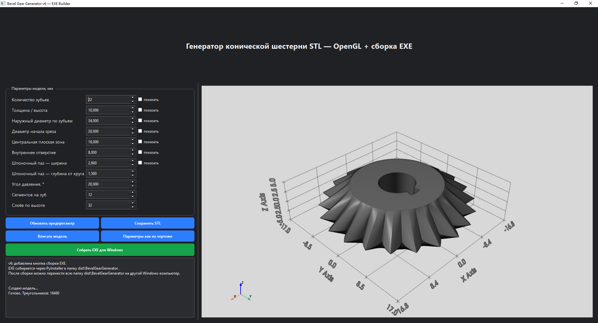

# Bevel Gear STL Generator



A desktop parametric bevel-gear generator with interactive 3D preview and STL export. The application is designed for quickly creating customizable bevel gear models for prototyping, CAD work, mechanical experiments, robotics, and 3D printing.

## Project Overview

This project focuses specifically on **bevel gears**, where the tooth geometry is distributed around a tapered gear body rather than a cylindrical spur-gear body. It is a separate application from the modular spur/helical gear generator because the geometry, controls, and model-building workflow are different.

The program provides a graphical interface for defining the principal gear dimensions, generating the model, inspecting it in an embedded 3D viewer, and exporting the resulting mesh as an STL file.

## Main Features

- Parametric bevel-gear generation
- Configurable tooth count
- Adjustable outer diameter
- Adjustable gear height / thickness
- Pressure-angle configuration
- Configurable center bore
- Keyway dimensions
- Mesh/detail resolution control
- Interactive 3D preview
- Optional dimension overlays
- STL export
- Dark Windows desktop interface
- PyInstaller-based standalone EXE build

## Parametric Controls

The application exposes the main parameters required to rapidly create and compare bevel-gear variants:

- number of teeth;
- outside diameter;
- overall height;
- diameter where the tapered tooth section begins;
- center flat-zone diameter;
- center-bore diameter;
- keyway width and depth;
- pressure angle;
- segments per tooth;
- number of height layers.

## 3D Preview

The integrated viewer is based on **PyVista/VTK** and provides immediate visual feedback before export. The user can rotate and inspect the generated gear and optionally display dimensional annotations for the outside diameter, height, tooth count, center regions, bore, and keyway.

## STL Export

The generated geometry can be exported directly as STL for use with slicers, CAD assemblies, mechanical prototypes, educational models, robotics, and transmission experiments.

## Technology Stack

- **Python 3.11+**
- **PySide6** — desktop GUI
- **NumPy** — numerical geometry
- **Trimesh** — mesh creation and STL export
- **PyVista / PyVistaQt** — embedded 3D viewer
- **VTK** — visualization backend
- **PyInstaller** — optional standalone Windows build

## Project Structure

```text
Bevel-Gear-STL-Generator/
├── main.py
├── requirements.txt
├── install.bat
├── start.bat
├── build_exe.bat
├── README.md
├── README_RU.txt
└── .gitignore
```

## Installation

Python 3.11 or newer is recommended.

On Windows:

```text
install.bat
```

The installer creates a local `.venv` and installs all dependencies listed in `requirements.txt`.

Start the application with:

```text
start.bat
```

Or manually:

```bash
python -m venv .venv
.venv\Scripts\python -m pip install -r requirements.txt
.venv\Scripts\python main.py
```

## Building a Windows EXE

Run:

```text
build_exe.bat
```

The PyInstaller output is created under:

```text
dist\BevelGearGenerator\
```

The application also contains a **Build EXE for Windows** button that invokes PyInstaller from the GUI.

## Typical Workflow

1. Enter the required tooth count.
2. Define the main gear dimensions.
3. Configure the center bore and keyway.
4. Set the pressure angle and mesh resolution.
5. Generate or refresh the 3D preview.
6. Inspect the model and optional dimensions.
7. Export the finished gear as STL.

## Use Cases

- Custom bevel-gear prototypes
- 3D-printed transmissions
- Robotics mechanisms
- Educational demonstrations
- Rapid mechanical-design experiments
- CAD concept development

## Repository Notes

Large local runtimes, virtual environments, build outputs, generated meshes, cache files, and application screenshots are intentionally excluded from this public source snapshot. Install dependencies locally using `install.bat` or `requirements.txt`.

## Verification

The published Python source was syntax-checked before publication. Full GUI execution and dependency installation require a Windows/Python environment with the packages from `requirements.txt`.

## Future Development

Possible future improvements include mating-pair generation, additional bevel-gear geometry options, more advanced tooth calculations, tolerance/backlash controls, additional export formats, and manufacturing presets.

## Disclaimer

The generated models are intended for prototyping and engineering development. For load-bearing or safety-critical applications, gear geometry, materials, clearances, manufacturing tolerances, lubrication, and applicable mechanical standards should be independently verified.
